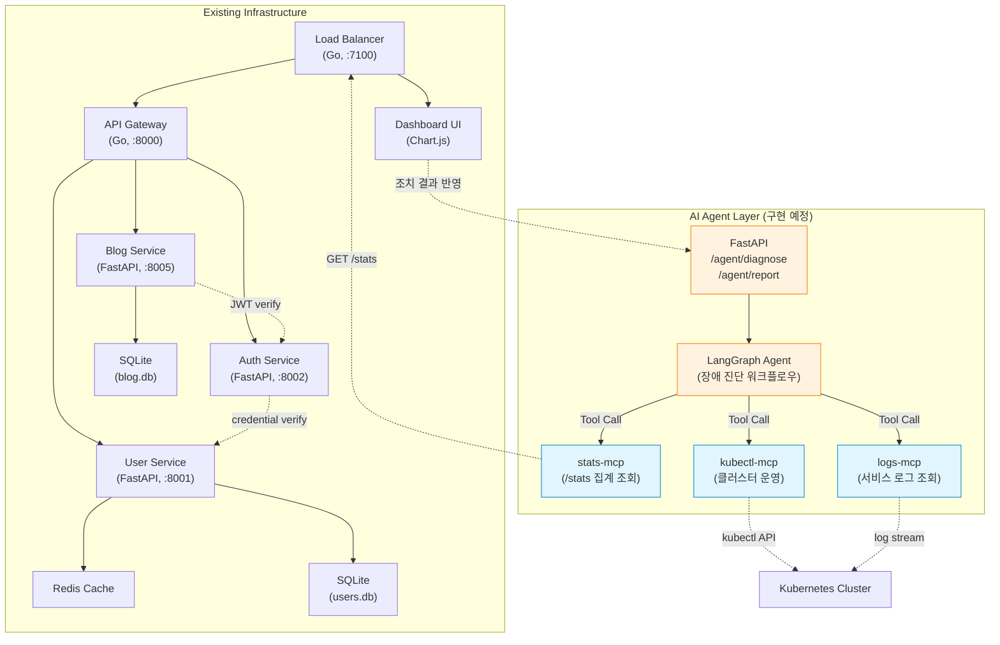
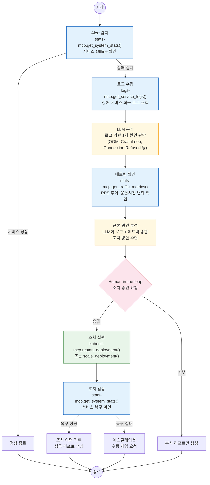

# AI-Powered K8s Operations Platform
<p align="center"></p>

마이크로서비스 기반 쿠버네티스 모니터링 플랫폼으로, 실시간 관측 인프라(Go Load Balancer, FastAPI 서비스, WebSocket 하트비트)를 AI Agent가 호출 가능한 Tool로 설계한 프로젝트입니다.

**핵심 키워드**: `Kubernetes` | `Go` | `FastAPI` | `MCP Server(설계)` | `LangGraph Agent(설계)`

> AI Agent 자동 장애 진단 설계 → [AI Agent 확장 설계](#ai-agent-확장-설계)

## 프로젝트 구조

```
.
├── api-gateway      # Go 기반 API 게이트웨이
├── auth-service     # 사용자 인증 서비스 (FastAPI)
├── blog-service     # 블로그 예제 서비스 (FastAPI)
├── user-service     # 사용자 관리 서비스 (FastAPI + Redis)
├── load-balancer    # Go 로드밸런서 및 통계 수집기
├── dashboard-ui     # Chart.js 기반 모니터링 대시보드
├── k8s-manifests    # Kustomize 기반 쿠버네티스 매니페스트
├── load-tests       # 부하 테스트 셸 스크립트
├── docker-compose.yml
└── skaffold.yaml
```

## 서비스 개요

- **Load Balancer**: 각 서비스와 UI로의 요청을 프록시하고 `/stats` 엔드포인트에서 전체 지표를 집계합니다.
- **API Gateway**: `/api/*` 경로를 내부 서비스로 라우팅하여 인증, 사용자, 블로그 API를 단일 진입점으로 제공합니다.
- **User Service**: 사용자 등록·조회·인증 및 DB/캐시 상태를 반환하는 `/stats` 엔드포인트를 제공합니다.
- **Auth Service**: 로그인과 JWT 토큰 검증 기능을 제공하며 `/stats` 로 간단한 상태 정보를 반환합니다.
- **Blog Service**: 게시물 CRUD API(조회/등록/수정/삭제)와 샘플 SPA 페이지를 포함하는 예제 서비스입니다.

---

## AI Agent 확장 설계

> 이 섹션은 기존 모니터링 인프라를 AI Agent의 Tool로 확장하기 위한 아키텍처 설계입니다.
> 현재 코드베이스에는 AI Agent Layer가 포함되어 있지 않으며, stats-mcp부터 순차적으로 구현할 계획입니다.

### 설계 배경

이 프로젝트를 운영하면서 장애 진단이 반복적인 패턴(로그 확인 → 메트릭 조회 → 원인 추론 → 조치)으로 이루어진다는 것을 확인했습니다. 이 반복 패턴을 자동화하기 위해 기존 인프라의 데이터 소스를 AI Agent의 Tool로 변환하는 설계를 시작했습니다.

`/stats` 집계, 서비스 상태 감지, WebSocket 하트비트 등 **이미 구축된 관측 인프라**는 AI Agent가 Tool로 활용하기에 적합한 구조입니다. 이 데이터 소스들을 MCP(Model Context Protocol) Server로 래핑하고 LangGraph 기반 Agent가 호출하면, 장애 감지 → 원인 분석 → 조치까지의 운영 워크플로우를 자동화할 수 있습니다.

### 기술 선택 근거

- **MCP(Model Context Protocol)**: 기존 REST 엔드포인트를 LLM이 호출 가능한 Tool로 변환하는 표준 프로토콜. 새로운 인프라 구축 없이 기존 시스템을 AI Agent에 연결 가능. Claude Desktop, Cursor, Gemini CLI 등 어떤 클라이언트에서든 동일 Tool 사용 가능(상호운용성).
- **LangGraph**: 장애 진단의 "감지 → 분석 → 조치" 순차 워크플로우가 상태 머신 패턴에 적합. 단순 chain보다 조건 분기(Human-in-the-loop)와 재시도 로직을 명시적으로 관리 가능.

### 아키텍처 개요



- **실선 화살표**: 현재 구현된 서비스 간 통신
- **점선 화살표**: 향후 AI Agent Layer가 기존 인프라와 연결되는 지점
- MCP Server는 기존 엔드포인트를 래핑하여 LLM이 호출 가능한 Tool로 변환

### MCP Server Layer 설계

기존 서비스의 실제 엔드포인트를 MCP Tool로 변환하는 매핑입니다.

#### stats-mcp (기존 /stats 인프라 활용)

| MCP Tool Name | 원본 엔드포인트 | 입력 파라미터 | 출력 | 설명 |
|---|---|---|---|---|
| `get_system_stats` | `GET /stats` (Load Balancer) | 없음 | 전체 서비스 상태 JSON | LB가 4개 서비스에서 병렬 수집한 집계 데이터 |
| `get_service_status` | `GET /stats` → 특정 키 추출 | `service_name: string` | 개별 서비스 상태 | api-gateway, auth, user_service, blog_service 중 선택 |
| `get_traffic_metrics` | `GET /stats` → load-balancer 키 | 없음 | RPS, 응답시간, 성공률 | 10초 윈도우 기반 실시간 메트릭 |
| `check_health` | `GET /health` (각 서비스, LB는 `/lb-health`) | `service_name: string` | health 상태 | 개별 서비스 헬스체크 |

#### kubectl-mcp (Kubernetes 클러스터 운영)

| MCP Tool Name | kubectl 명령 매핑 | 입력 파라미터 | 출력 | 설명 |
|---|---|---|---|---|
| `list_pods` | `kubectl get pods -n titanium-local` | `namespace?: string` | Pod 목록 + 상태 | 네임스페이스 내 Pod 현황 |
| `describe_pod` | `kubectl describe pod` | `pod_name: string` | Pod 상세 정보 | Events, Conditions 포함 |
| `get_pod_logs` | `kubectl logs` | `pod_name: string, tail?: int` | 로그 텍스트 | 최근 N줄 로그 조회 |
| `restart_deployment` | `kubectl rollout restart` | `deployment: string` | 실행 결과 | Human-in-the-loop 승인 후 실행 |
| `scale_deployment` | `kubectl scale` | `deployment: string, replicas: int` | 실행 결과 | Human-in-the-loop 승인 후 실행 |

#### logs-mcp (서비스 로그 조회)

| MCP Tool Name | 데이터 소스 | 입력 파라미터 | 출력 | 설명 |
|---|---|---|---|---|
| `get_service_logs` | 컨테이너 stdout/stderr | `service: string, since?: string, tail?: int` | 로그 텍스트 | 특정 서비스의 최근 로그 |
| `search_logs` | 컨테이너 로그 grep | `service: string, pattern: string` | 매칭 로그 라인 | 에러 패턴 검색 |

### LangGraph Agent 설계

장애 감지부터 조치까지의 자동화 워크플로우를 LangGraph 상태 머신으로 설계합니다.



**예시 시나리오: blog-service Offline 감지**

1. `stats-mcp`로 `/stats` 조회 → `blog_service.service_status = "offline"` 확인
2. `logs-mcp`로 blog-service 컨테이너 최근 100줄 로그 수집
3. LLM이 로그 분석 → `sqlite3.OperationalError: database is locked` 패턴 발견
4. `stats-mcp`로 트래픽 메트릭 확인 → 직전 RPS 급증 (80 → 150 RPS) 확인
5. LLM 종합 판단: "동시 쓰기 폭증으로 SQLite 락 경합 → 서비스 크래시"
6. 조치 방안: Pod 재시작 + 향후 write-ahead logging 모드 전환 권고
7. Human-in-the-loop: 운영자 승인 후 `kubectl-mcp`로 rollout restart 실행
8. 재시작 후 `stats-mcp`로 복구 확인 → 리포트 생성

---

## 비기능 요구사항 (요약)

- **성능 목표**: 안정적 처리량 100 RPS.
- **확장성(기본 복제 수)**: 고가용성 확보를 위해 서비스 기본 2 Pod(상태 저장/인프라형은 1). 예) `api-gateway` 2, `load-balancer` 2, `auth-service` 2, `user-service` 2, `dashboard-ui` 2, `redis` 1, `blog-service` 1.
- **안정성(Timeouts)**: 서비스 간 호출에 짧은 타임아웃을 적용하여 장애 전파를 차단.

## 안정성 설계 (Timeouts)

- **Load Balancer → 각 서비스 `/stats` 호출**:
  - **HTTP 클라이언트 타임아웃**: `2s` 적용
  - 코드: `load-balancer/main.go`의 `/stats` 핸들러 내 `http.Client{ Timeout: 2 * time.Second }`
  - 개별 서비스 호출: 완전한 URL(`.../stats`)을 사용해 고루틴 병렬 수집
- **API Gateway → 내부 서비스 프록시**:
  - **Transport 타임아웃**: `ResponseHeaderTimeout=2s`, `IdleConnTimeout=30s`, `ExpectContinueTimeout=1s`
  - **Server 타임아웃**: `ReadHeaderTimeout=2s`, `WriteTimeout=10s`, `IdleTimeout=60s`
  - 코드: `api-gateway/main.go`의 `httputil.ReverseProxy.Transport` 및 `http.Server` 설정

## 프록시/집계 경로 구성 및 100 RPS 최적화

- **경로 구성**: `Load Balancer`는 UI(`/`), API(`/api/*`)를 프록시하고, `/stats`에서 각 서비스의 `/stats`를 병렬 수집 후 통합 응답을 제공합니다.
- **집계 최적화**: 최근 10초 윈도우로 RPS·평균 응답시간을 계산해 스파이크에도 민감하게 반응하면서 노이즈를 억제합니다.
- **오버헤드 최소화**: 통계 미들웨어가 `/api/*` 실트래픽만 집계하고, 하트비트/HEAD는 제외해 측정 비용을 줄입니다.
- **백프레셔**: 서비스 호출에 `2s` 타임아웃을 두어 느린 서비스가 전체 집계를 지연시키지 않도록 격리합니다.
- **목표 부하(100 RPS)**: 위 구성으로 평균 응답시간과 실패율을 안정화하고, 네트워크/프록시 타임아웃으로 장애 전파를 차단합니다.

## 대시보드 하트비트 (WebSocket)

- **엔드포인트**: `ws(s)://<LB>/api/ws-heartbeat` (gorilla/websocket)
- **이유**: 실제 사용자 트래픽이 없을 때도 운영 중인 상태를 반영하기 위해 WS 연결을 유지하며 활동을 신호로 보냅니다. HTTP 하트비트는 측정 제외 정책(HEAD/X-Heartbeat)과 충돌할 수 있어 WS를 채택했습니다.
- **역할**: 연결이 유지되는 동안 주기적 ping/pong 및 메시지로 "실제 활동"을 LB가 감지하여 IDLE 상태를 방지
- **대시보드 토글**: `index.html`의 `#toggle-ws-heartbeat-btn` 버튼으로 ON/OFF 제어
  - ON: 클라이언트가 5초마다 `"hb"` 메시지를 전송, 끊기면 2초 후 자동 재연결
  - OFF: 연결 종료 및 전송 중단
- **HTTP 하트비트**: 기본 비활성화. 필요 시 `script.js`의 `config.heartbeat`로 GET `/api/health`를 사용할 수 있음

## 대시보드 핵심 KPI

- **시스템 현황**: 전체 상태, 활성 서비스 수, 현재 RPS, 평균 응답시간에 집중합니다.
- **데이터 저장소 상태**: `stats.database.status`, `stats.cache.status`를 ONLINE/OFFLINE으로 단순 표기합니다.
- **알람 단순화**: 서비스 Offline 감지 위주로 노이즈를 줄였습니다.

## 트래픽 집계 기준 (IDLE 관련)

- **집계 기준**: LB 미들웨어는 `/api/*` 경로의 요청만 "실제 API 트래픽"으로 집계하며, `HEAD` 요청과 `X-Heartbeat: true`는 제외
- **IDLE 판단**: 최근 10초간 실제 API 트래픽(또는 WS 활동)이 없으면 `has_real_traffic=false`로 보고, 대시보드가 IDLE을 표기
- **해결 방법**: 실제 API 호출 또는 WS 하트비트(권장)를 활성화하면 IDLE이 해제되고 지표가 업데이트됨

## 부하 테스트

**위치:** `load-tests/mixed_load.sh`, `load-tests/mixed_load_plus.sh`, `load-tests/diag_delete.sh`
**의존성:** `sh`, `curl` *(옵션: `jq`가 있으면 `/stats` 출력이 보기 좋게 표시됨)*


### 실행 방법

- 기본 혼합 부하(목록/상세/생성)
```sh
cd load-tests
sh ./mixed_load.sh --url http://127.0.0.1:30700 --duration 60s --rate-list 64 --rate-detail 12 --rate-create 4
```

- 확장 혼합 부하(수정/삭제 포함 + 종료 후 일부 정리)
```sh
cd load-tests
sh ./mixed_load_plus.sh --url http://127.0.0.1:30700 --duration 60s --rate-list 40 --rate-detail 15 --rate-create 8 --rate-update 4 --rate-delete 3
```

- 생성된 테스트 게시글 정리만 실행
```sh
sh ./mixed_load_plus.sh --url http://127.0.0.1:30700 --cleanup
```

- 삭제 기능 진단(생성→조회→삭제→확인)
```sh
sh ./diag_delete.sh --url http://127.0.0.1:30700
```


### 실행 시나리오(요약)

- **사전:** 테스트 사용자 **등록/로그인 → JWT 발급**, 상세 조회용 **시드 게시글 5개 생성**
- **동시:**
  - 목록 `GET /api/posts`
  - 상세 `GET /api/posts/{id}` *(시드 랜덤)*
  - 생성 `POST /api/posts`
- **확장:**
  - 수정 `PATCH /api/posts/{id}`
  - 삭제 `DELETE /api/posts/{id}` 포함


### 결과/모니터링

- **LB `/stats`**: `requests_per_second`, `avg_response_time_ms`, `success_rate`, `has_real_traffic` 확인
- **실패율**은 낮게(**≈2% 미만**), **p95 지연**은 허용 범위 내로 유지되도록 **RPS/지속시간**을 조정

> **주의:** 시드 글은 제목이 `seed-` → **수정 시** `upd-`로 바뀔 수 있고, 확장 스크립트 정리는 **"이번 실행에서 생성한 글"** 위주로 진행됩니다. 동일 제목의 다른 글이 남아 보일 수 있으니 **ID 기준**으로 확인하세요.

## 로컬 실행

### Docker Compose

```bash
docker-compose up --build
```

- 로드밸런서: <http://localhost:7100>
- 대시보드: <http://localhost:7100>
- API 게이트웨이: <http://localhost:7100/api/>

### Kubernetes (Skaffold)

아래 단계대로 실행하면 로컬 클러스터에서 대시보드를 확인할 수 있습니다.

1) 전제 조건 설치
- Docker, kubectl, Skaffold
- 로컬 K8s 클러스터(택1): minikube 또는 kind

2) 클러스터 준비
- minikube 사용 시
  ```bash
  minikube start
  # skaffold가 빌드한 이미지를 바로 사용하도록 로컬 Docker 데몬 연결
  eval "$(minikube -p minikube docker-env)"
  ```
- kind 사용 시 (최초 1회)
  ```bash
  kind create cluster
  # skaffold가 빌드 이미지를 kind 노드에 자동 로드하도록 설정
  skaffold config set --global local-cluster true
  ```

3) 배포 실행 (프로젝트 루트에서)
```bash
skaffold dev
```
빌드 완료 후 `titanium-local` 네임스페이스로 리소스가 배포됩니다.

4) 상태 확인
```bash
kubectl -n titanium-local get pods,svc
```

5) 브라우저 접속
- minikube:
  ```bash
  minikube service local-load-balancer-service -n titanium-local --url
  ```
  출력된 URL을 브라우저로 열기 (예: http://127.0.0.1:30700)
- kind/그 외:
  ```bash
  kubectl -n titanium-local port-forward svc/local-load-balancer-service 7100:7100
  ```
  브라우저에서 http://localhost:7100 접속

6) 동작 확인
```bash
curl -s http://localhost:7100/stats | jq .   # 집계 지표
```

7) 종료/정리
```bash
# skaffold 개발 모드 중지
Ctrl + C
# 배포 리소스 정리
skaffold delete
```

## 의존성

- Docker / Docker Compose
- kubectl, Skaffold, Kustomize
- Go 1.24+, Python 3.10+

## 데이터 백업 CronJob

- **목적**: `user-service`의 SQLite(`users.db`)를 주기적으로 백업하여 디스크 장애·실수로 인한 손상에 대비합니다.
- **스케줄**: 매일 자정(UTC) 실행. 파일명을 타임스탬프와 함께 `/backup/users.db.YYYY-mm-dd-HHMMSS`로 보관합니다.
- **구성**: CronJob 컨테이너에서 PVC를 `/data`(원본, RO)와 `/backup`(백업)으로 마운트하여 단순 복사합니다.
- **참고 파일**: `k8s-manifests/base/user-service-backup-cronjob.yaml`
- **운영 권장**: 데모 환경은 동일 PVC를 재사용하지만, 실제 운영은 별도 PV/PVC 또는 외부 스토리지(NFS/S3 등) 사용을 권장합니다.
