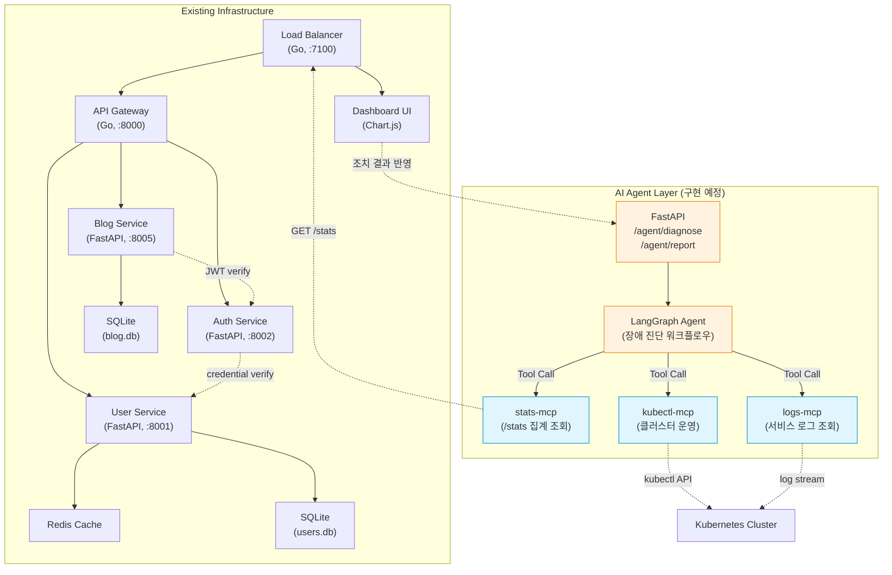
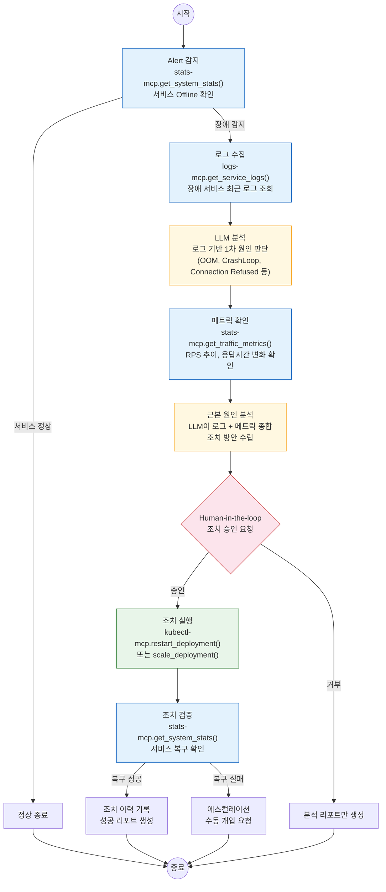

# AI Agent 확장 설계

> 이 문서는 기존 모니터링 인프라를 AI Agent의 Tool로 확장하기 위한 아키텍처 설계입니다.
> 현재 코드베이스에는 AI Agent Layer가 포함되어 있지 않으며, stats-mcp부터 순차적으로 구현할 계획입니다.

## 설계 배경

이 프로젝트를 운영하면서 장애 진단이 반복적인 패턴(로그 확인 → 메트릭 조회 → 원인 추론 → 조치)으로 이루어진다는 것을 확인했습니다. 이 반복 패턴을 자동화하기 위해 기존 인프라의 데이터 소스를 AI Agent의 Tool로 변환하는 설계를 시작했습니다.

`/stats` 집계, 서비스 상태 감지, WebSocket 하트비트 등 **이미 구축된 관측 인프라**는 AI Agent가 Tool로 활용하기에 적합한 구조입니다. 이 데이터 소스들을 MCP(Model Context Protocol) Server로 래핑하고 LangGraph 기반 Agent가 호출하면, 장애 감지 → 원인 분석 → 조치까지의 운영 워크플로우를 자동화할 수 있습니다.

## 기술 선택 근거

- **MCP(Model Context Protocol)**: 기존 REST 엔드포인트를 LLM이 호출 가능한 Tool로 변환하는 표준 프로토콜. 새로운 인프라 구축 없이 기존 시스템을 AI Agent에 연결 가능. Claude Desktop, Cursor, Gemini CLI 등 어떤 클라이언트에서든 동일 Tool 사용 가능(상호운용성).
- **LangGraph**: 장애 진단의 "감지 → 분석 → 조치" 순차 워크플로우가 상태 머신 패턴에 적합. 단순 chain보다 조건 분기(Human-in-the-loop)와 재시도 로직을 명시적으로 관리 가능.

## 아키텍처 개요

- **실선 화살표**: 현재 구현된 서비스 간 통신
- **점선 화살표**: 향후 AI Agent Layer가 기존 인프라와 연결되는 지점
- MCP Server는 기존 엔드포인트를 래핑하여 LLM이 호출 가능한 Tool로 변환

## MCP Server Layer 설계

기존 서비스의 실제 엔드포인트를 MCP Tool로 변환하는 매핑입니다.

### stats-mcp (기존 /stats 인프라 활용)

| MCP Tool Name | 원본 엔드포인트 | 입력 파라미터 | 출력 | 설명 |
|---|---|---|---|---|
| `get_system_stats` | `GET /stats` (Load Balancer) | 없음 | 전체 서비스 상태 JSON | LB가 4개 서비스에서 병렬 수집한 집계 데이터 |
| `get_service_status` | `GET /stats` → 특정 키 추출 | `service_name: string` | 개별 서비스 상태 | api-gateway, auth, user_service, blog_service 중 선택 |
| `get_traffic_metrics` | `GET /stats` → load-balancer 키 | 없음 | RPS, 응답시간, 성공률 | 10초 윈도우 기반 실시간 메트릭 |
| `check_health` | `GET /health` (각 서비스, LB는 `/lb-health`) | `service_name: string` | health 상태 | 개별 서비스 헬스체크 |

### kubectl-mcp (Kubernetes 클러스터 운영)

| MCP Tool Name | kubectl 명령 매핑 | 입력 파라미터 | 출력 | 설명 |
|---|---|---|---|---|
| `list_pods` | `kubectl get pods -n titanium-local` | `namespace?: string` | Pod 목록 + 상태 | 네임스페이스 내 Pod 현황 |
| `describe_pod` | `kubectl describe pod` | `pod_name: string` | Pod 상세 정보 | Events, Conditions 포함 |
| `get_pod_logs` | `kubectl logs` | `pod_name: string, tail?: int` | 로그 텍스트 | 최근 N줄 로그 조회 |
| `restart_deployment` | `kubectl rollout restart` | `deployment: string` | 실행 결과 | Human-in-the-loop 승인 후 실행 |
| `scale_deployment` | `kubectl scale` | `deployment: string, replicas: int` | 실행 결과 | Human-in-the-loop 승인 후 실행 |

### logs-mcp (서비스 로그 조회)

| MCP Tool Name | 데이터 소스 | 입력 파라미터 | 출력 | 설명 |
|---|---|---|---|---|
| `get_service_logs` | 컨테이너 stdout/stderr | `service: string, since?: string, tail?: int` | 로그 텍스트 | 특정 서비스의 최근 로그 |
| `search_logs` | 컨테이너 로그 grep | `service: string, pattern: string` | 매칭 로그 라인 | 에러 패턴 검색 |

## LangGraph Agent 설계

장애 감지부터 조치까지의 자동화 워크플로우를 LangGraph 상태 머신으로 설계합니다.

**예시 시나리오: blog-service Offline 감지**

1. `stats-mcp`로 `/stats` 조회 → `blog_service.service_status = "offline"` 확인
2. `logs-mcp`로 blog-service 컨테이너 최근 100줄 로그 수집
3. LLM이 로그 분석 → `sqlite3.OperationalError: database is locked` 패턴 발견
4. `stats-mcp`로 트래픽 메트릭 확인 → 직전 RPS 급증 (80 → 150 RPS) 확인
5. LLM 종합 판단: "동시 쓰기 폭증으로 SQLite 락 경합 → 서비스 크래시"
6. 조치 방안: Pod 재시작 + 향후 write-ahead logging 모드 전환 권고
7. Human-in-the-loop: 운영자 승인 후 `kubectl-mcp`로 rollout restart 실행
8. 재시작 후 `stats-mcp`로 복구 확인 → 리포트 생성
