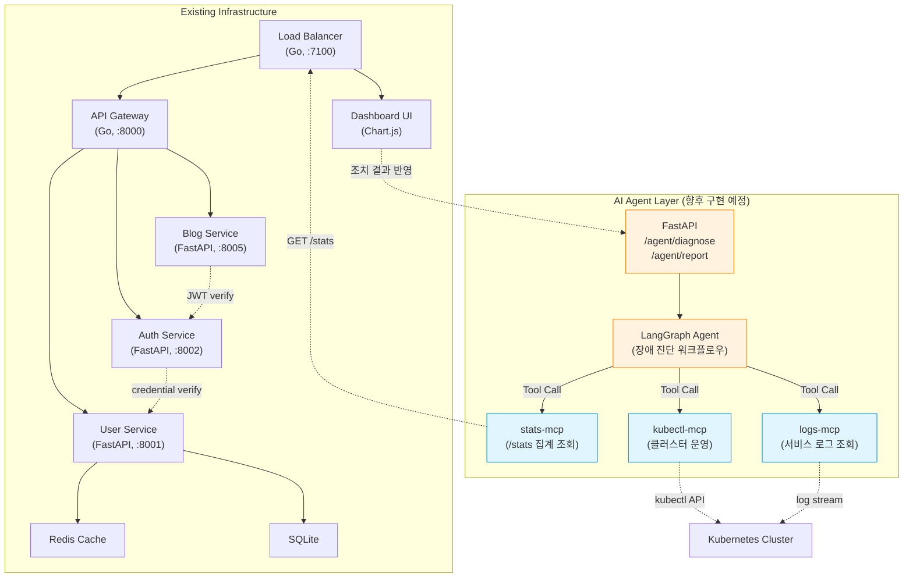
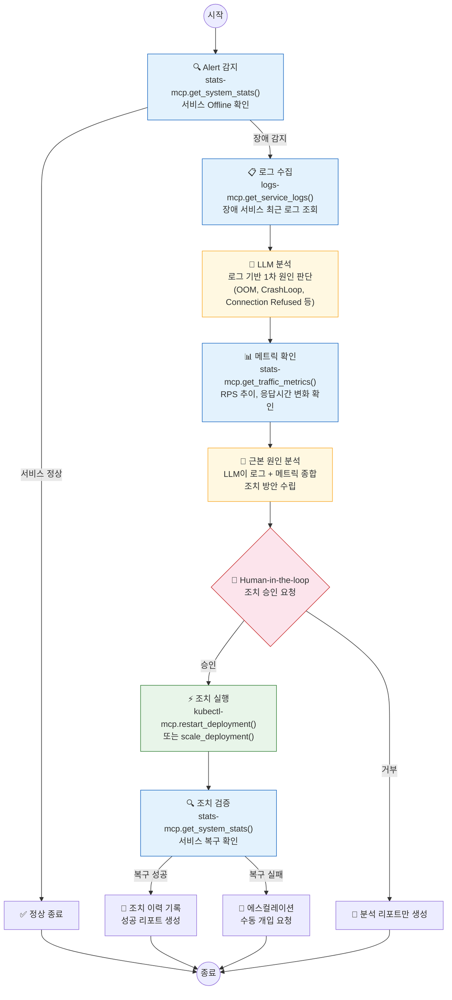

# README 재구성 설계서

## 1. README 전체 목차 구조

기존 섹션을 최대한 보존하면서, AI Agent 섹션을 **기존 인프라 설명 직후 / 실행 방법 직전**에 배치합니다.
이유: 읽는 순서가 "이 프로젝트가 뭔지 → 어떤 서비스가 있는지 → AI로 어떻게 확장하는지 → 직접 실행하려면" 흐름이 자연스럽기 때문입니다.

```
# Monitoring Service
  (기존) 프로젝트 소개 + 스크린샷
  (수정) 한 줄 추가: AI Agent 확장 설계 언급

## 프로젝트 구조
  (기존 유지, 변경 없음)

## 서비스 개요
  (기존 유지, 변경 없음)

## 비기능 요구사항 (요약)
  (기존 유지, 변경 없음)

## 안정성 설계 (Timeouts)
  (기존 유지, 변경 없음)

## 프록시/집계 경로 구성 및 100 RPS 최적화
  (기존 유지, 변경 없음)

## 대시보드 하트비트 (WebSocket)
  (기존 유지, 변경 없음)

## 대시보드 핵심 KPI
  (기존 유지, 변경 없음)

## 트래픽 집계 기준 (IDLE 관련)
  (기존 유지, 변경 없음)

--- ✨ 여기부터 신규 ---

## AI Agent 확장 설계 (향후 구현 예정)        ← 신규 섹션
  ### 설계 배경
  ### 아키텍처 개요 (Mermaid 다이어그램)
  ### MCP Server Layer 설계
    - MCP Tool 매핑 테이블
  ### LangGraph Agent 설계
    - 장애 자동 진단 시나리오 흐름도 (Mermaid)
  ### 관련 경험: gemini-mcp

--- 기존 섹션 계속 ---

## 부하 테스트
  (기존 유지, 변경 없음)

## 로컬 실행
  (기존 유지, 변경 없음)

## 의존성
  (기존 유지, 변경 없음)

## 데이터 백업 CronJob
  (기존 유지, 변경 없음)
```

---

## 2. AI Agent Integration 섹션 상세 구조

### 2-1. 설계 배경 (3-4줄)

기존 모니터링 플랫폼이 제공하는 `/stats` 집계, 서비스 상태 감지, WebSocket 하트비트 등의 **관측 인프라**를 AI Agent의 Tool로 활용하면, 장애 감지 → 원인 분석 → 조치까지 자동화할 수 있다는 설계 방향을 설명합니다.

> **핵심 메시지**: "이미 구축된 마이크로서비스 인프라가 AI Agent의 Tool/Data Source가 된다"

명확히 **"향후 구현 예정"**임을 표기합니다.

---

### 2-2. 아키텍처 개요 (Mermaid 다이어그램)

기존 서비스 토폴로지 위에 AI Agent Layer를 얹은 전체 구조도입니다.



**설계 의도 설명 (다이어그램 아래 텍스트)**:
- 실선 화살표: 현재 구현된 서비스 간 통신
- 점선 화살표: 향후 AI Agent Layer가 기존 인프라와 연결되는 지점
- MCP Server는 기존 엔드포인트를 래핑하여 LLM이 호출 가능한 Tool로 변환

---

### 2-3. MCP Server Layer 설계 - Tool 매핑 테이블

기존 서비스의 실제 엔드포인트를 MCP Tool로 변환하는 매핑입니다.

#### stats-mcp (기존 /stats 인프라 활용)

| MCP Tool Name | 원본 엔드포인트 | 입력 파라미터 | 출력 | 설명 |
|---|---|---|---|---|
| `get_system_stats` | `GET /stats` (Load Balancer) | 없음 | 전체 서비스 상태 JSON | LB가 4개 서비스에서 병렬 수집한 집계 데이터 |
| `get_service_status` | `GET /stats` → 특정 키 추출 | `service_name: string` | 개별 서비스 상태 | api-gateway, auth, user_service, blog_service 중 선택 |
| `get_traffic_metrics` | `GET /stats` → load-balancer 키 | 없음 | RPS, 응답시간, 성공률 | 10초 윈도우 기반 실시간 메트릭 |
| `check_health` | `GET /health` (각 서비스) | `service_name: string` | health 상태 | 개별 서비스 헬스체크 |

#### kubectl-mcp (Kubernetes 클러스터 운영)

| MCP Tool Name | kubectl 명령 매핑 | 입력 파라미터 | 출력 | 설명 |
|---|---|---|---|---|
| `list_pods` | `kubectl get pods -n titanium-local` | `namespace?: string` | Pod 목록 + 상태 | 네임스페이스 내 Pod 현황 |
| `describe_pod` | `kubectl describe pod` | `pod_name: string` | Pod 상세 정보 | Events, Conditions 포함 |
| `get_pod_logs` | `kubectl logs` | `pod_name: string, tail?: int` | 로그 텍스트 | 최근 N줄 로그 조회 |
| `restart_deployment` | `kubectl rollout restart` | `deployment: string` | 실행 결과 | Human-in-the-loop 승인 후 실행 |
| `scale_deployment` | `kubectl scale` | `deployment: string, replicas: int` | 실행 결과 | Human-in-the-loop 승인 후 실행 |

#### logs-mcp (서비스 로그 조회)

| MCP Tool Name | 데이터 소스 | 입력 파라미터 | 출력 | 설명 |
|---|---|---|---|---|
| `get_service_logs` | 컨테이너 stdout/stderr | `service: string, since?: string, tail?: int` | 로그 텍스트 | 특정 서비스의 최근 로그 |
| `search_logs` | 컨테이너 로그 grep | `service: string, pattern: string` | 매칭 로그 라인 | 에러 패턴 검색 |

---

### 2-4. LangGraph Agent 설계 - 장애 자동 진단 시나리오



**시나리오 텍스트 설명** (다이어그램 아래에 배치):

```
예시: blog-service가 Offline으로 감지된 경우

1. stats-mcp로 /stats 조회 → blog_service.service_status = "offline" 확인
2. logs-mcp로 blog-service 컨테이너 최근 100줄 로그 수집
3. LLM이 로그 분석 → "sqlite3.OperationalError: database is locked" 패턴 발견
4. stats-mcp로 트래픽 메트릭 확인 → 직전 RPS 급증 (80 → 150 RPS) 확인
5. LLM 종합 판단: "동시 쓰기 폭증으로 SQLite 락 경합 → 서비스 크래시"
6. 조치 방안: Pod 재시작 + 향후 write-ahead logging 모드 전환 권고
7. Human-in-the-loop: 운영자 승인 후 kubectl-mcp로 rollout restart 실행
8. 재시작 후 stats-mcp로 복구 확인 → 리포트 생성
```

---

### 2-5. 관련 경험: gemini-mcp

AI Agent Layer 설계의 근거가 되는 실제 MCP 개발 경험을 간략히 연결합니다.

```
> 이 설계는 실제 MCP Server 개발 경험을 기반으로 합니다.
> [gemini-mcp](https://www.npmjs.com/package/@dongju101/gemini-mcp) -
> Gemini CLI를 MCP Server로 래핑한 TypeScript 패키지 (npm 퍼블리시)
> - FastMCP v3.33.0 기반, 2,062 lines 소스 / 2,869 lines 테스트
> - 멀티세션 아키텍처, 토큰 자동 리셋, fallback chain 구현
> - 이 경험을 바탕으로 기존 모니터링 인프라의 MCP Tool 변환을 설계했습니다.
```

**작성 톤**: 자랑이 아니라 "이 설계가 공허한 계획이 아님"을 보여주는 근거로 제시. 1-2문단 이내.

---

## 3. 기존 섹션 수정 목록

기존 README 내용은 **거의 수정하지 않습니다**. 변경 사항은 최소한으로 제한합니다.

### 수정 1: 프로젝트 소개 문단 (1줄 추가)

**위치**: README.md 7번째 줄 (기존 소개 문단)

**현재**:
```
마이크로서비스 기반의 쿠버네티스 모니터링 대시보드 프로젝트입니다. 각 서비스는 독립적으로 컨테이너화되어 있으며 로드밸런서를 통해 트래픽이 분배되고, 대시보드를 통해 실시간 상태를 확인할 수 있습니다.
```

**변경 후**:
```
마이크로서비스 기반의 쿠버네티스 모니터링 대시보드 프로젝트입니다. 각 서비스는 독립적으로 컨테이너화되어 있으며 로드밸런서를 통해 트래픽이 분배되고, 대시보드를 통해 실시간 상태를 확인할 수 있습니다. 나아가, 이 인프라를 AI Agent의 Tool로 활용하는 자동 장애 진단 시스템을 설계하고 있습니다 ([상세 설계 →](#ai-agent-확장-설계-향후-구현-예정)).
```

**이유**: 첫 문단에서 AI Agent 방향성을 암시하되, 기존 설명을 그대로 유지합니다. 앵커 링크로 상세 섹션으로 안내합니다.

### 수정 2: 없음

기존 섹션(서비스 개요, 안정성 설계, 프록시/집계, 대시보드, 부하 테스트, 로컬 실행, 의존성, 백업)은 **일체 수정하지 않습니다**.

이유:
- 인프라 역량을 보여주는 기존 내용은 그 자체로 가치가 있음
- AI Agent 섹션과 기존 섹션의 톤 차이가 오히려 "실제 구현 vs 설계"의 구분을 명확히 해줌
- 불필요한 수정은 기존 코드와의 정합성을 깨뜨릴 위험이 있음

---

## 4. 구현 시 주의사항 (writer 에이전트 참고)

1. **"향후 구현 예정" 표기를 반드시 포함**: 섹션 제목과 첫 문단에 명시
2. **Mermaid 문법 검증**: GitHub에서 렌더링되려면 ` ```mermaid ` 코드블록 사용
3. **앵커 링크 호환**: GitHub는 한글 제목도 앵커로 변환하지만, 특수문자(괄호 등)는 제거됨. `#ai-agent-확장-설계-향후-구현-예정` 형태로 테스트 필요
4. **기존 내용 한 글자도 변경하지 말 것**: 소개 문단 1줄 추가를 제외하고는 기존 텍스트를 건드리지 않음
5. **Mermaid style 속성**: GitHub에서 `fill`, `stroke` 속성은 정상 렌더링됨. 다만 이모지(🔍, 🧠 등)는 Mermaid 노드 텍스트에서 깨질 수 있으므로 실제 작성 시 이모지 제거를 권장
6. **gemini-mcp 링크**: npm 패키지 링크는 `https://www.npmjs.com/package/@dongju101/gemini-mcp` 사용
